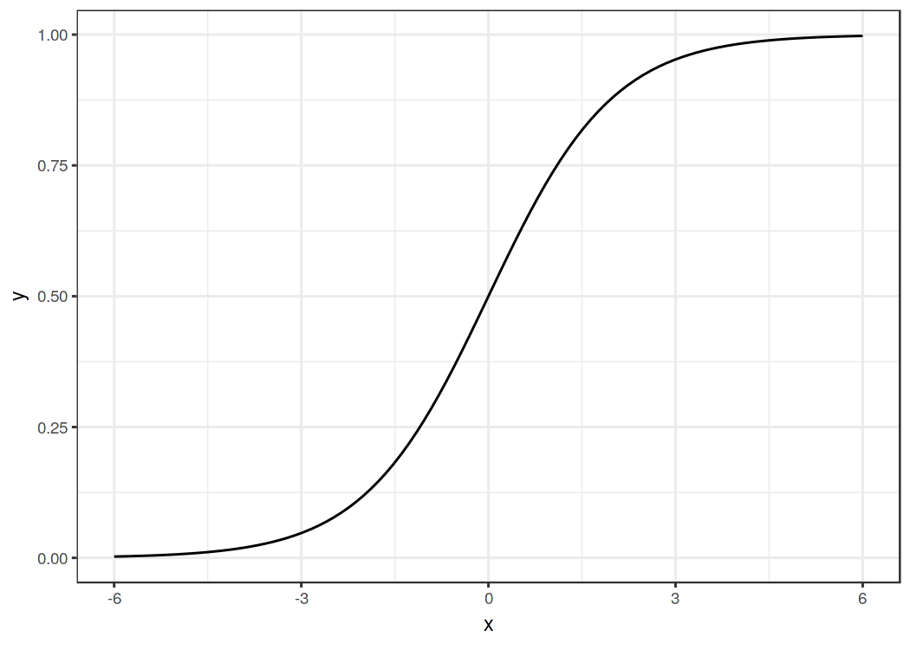

## Logistic Regression {#logistic}
Logistic regression is the linear regression model made fit for classification problems.

### What's Wrong with Linear Regression Models for Classification?
The  linear regression model works well in regression setups, but fails in the classification case.
Why is that?
In case of two classes, you could label one of the classes with 0 and the other with 1 and use a linear model on it and it would estimate the weights for you.
There are just a few problems with that approach:

- A linear model does not output probabilities, but it treats the classes as numbers (0 and 1) and fits the best hyperplane (if you have one feature, it's a line) that minimises the distances between the points and the hyperplane.
So it simply interpolates between the points, but there is no meaning in it and you cannot interpret it as probabilities.
- Also a linear model will extrapolate the features and give you values below zero and above one, which are not meaningful and should tell you that there might be a more clever approach to classification.
- Since the predicted outcome is not a probability but some linear interpolation between points there is no meaningful threshold at which you can distinguish one class from the other.
A good illustration of this issue was given on [Stackoverflow](https://stats.stackexchange.com/questions/22381/why-not-approach-classification-through-regression), which I reproduced in Figure \@ref(fig:linear-class-threshold)
- Linear models don't extend to classification problems with multiple classes.
You would have to start labeling the next class with a 2, then 3 and so on.
The classes might not have any meaningful order, but the linear model would force a weird structure on the relationship between the features and your class predictions.
So for a feature with a positive weight, the higher the value of that feature the more it contributes to the prediction of a class with a higher number, even if classes that happened to get a similar number are not related at all.

![An illustration why linear regression does not work well in a binary classification setting. A linear model is fitted on artificial data for classifying a tumour as malignant (1) or benign (0), dependant on the size of the tumour. Each point is a tumour, the x-axis shows the size of the tumour, the y-axis the malignancy, points are slightly jittered to reduce over-plotting. The lines display the fitted curve from a linear model. In the data setting on the left, we can use 0.5 as a threshold for the predicted outcome of the linear model for separating benign from malignant tumours. After introducing a few more malignant tumour cases, especially with larger tumour sizes, the regression line shifts and a threshold of 0.5 does not separate the classes any longer.](images/linear-class-threshold-1.png)

### Logistic Regression
A solution for classification is logistic regression.
Instead of fitting a straight line or hyperplane, the logistic regression model uses a non-linear function, the logistic function to squeeze the output of a linear equation between 0 and 1.
The logistic function is defined as:
{$$}\text{logistic}(\eta)=\frac{1}{1+exp(-\eta)}{/$$}
And it looks like shown in Figure \@ref(fig:logistic-function).

The step from linear regression models to logistic regression is kind of straightforward. In the linear regression model we modelled the relationship between the outcome and the features with a linear equation:
{$$}\hat{y}_{i}=\beta_{0}+\beta_{1}x_{i,1}+\ldots+\beta_{p}x_{i,p}{/$$}
For the classification we prefer probabilities, which are between 0 and 1, so we wrap the right side of the equation into the logistic regression function and like that force the output to only take on values between 0 and 1.
{$$}P(y_{i}=1)=\frac{1}{1+exp(-(\beta_{0}+\beta_{1}x_{i,1}+\ldots+\beta_{p}x_{i,p}))}{/$$}

Let's revisit the tumour size example from Figure \@ref(fig:linear-class-threshold) again.
But now instead of the linear regression model, we use the logistic regression model:

It works better with logistic regression and we can use 0.5 as a threshold in both cases. Including the additional points does not affect the estimated curve much.

