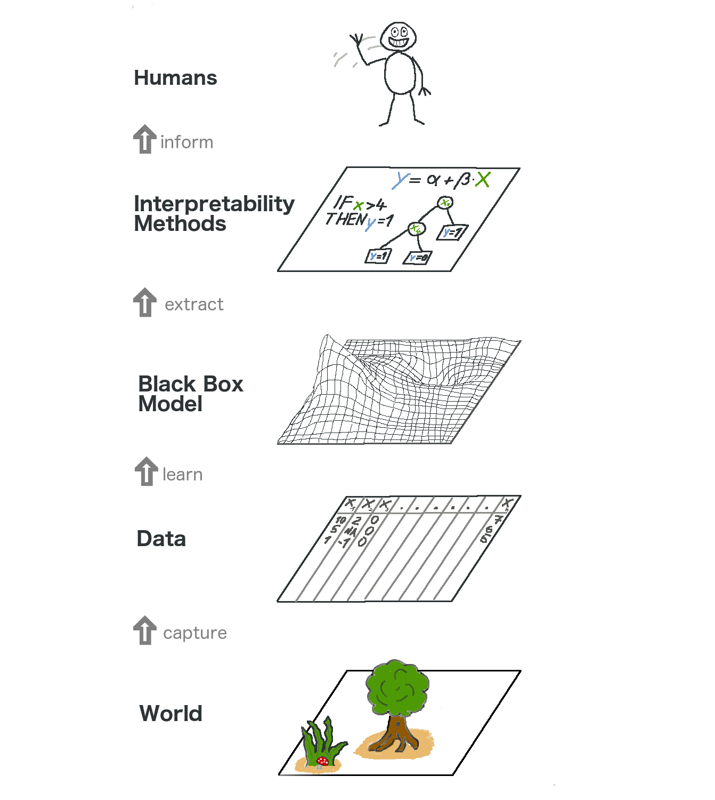

# Model-Agnostic Methods {#agnostic}
Separating the explanations from the machine learning model (= model-agnostic interpretability methods) has some benefits (Ribeiro, Singh, and Guestrin 2016[^Ribeiro2016]).
The big advantage of model-agnostic interpretability methods over model-specific ones is their flexibility.
The machine learning developer is free to use any machine learning model she likes, when the interpretability methods can be applied to any model.
Anything that is build on top of an interpretation of a machine learning model, like a graphic or some user interface, also becomes independent of the underlying machine learning model.
Usually not one but many types of machine learning models are evaluated for solving a task and if you compare the models in terms of interpretability, it is easier to do with model-agnostic explanations, because the same method can be used for any type of model.

An alternative to model-agnostic interpretability methods is using only [interpretable models](#simple), which often has the big disadvantage to usually loose accuracy compared to other machine learning models and locking you into one type of model and interpretability method.
The other alternative is to use model-specific interpretability methods.
The drawback here is also that it ties you to this one algorithm and it will be hard to switch to something else.

Desirable aspects of a model-agnostic explanation system are (Ribeiro, Singh, and Guestrin 2016):

- **Model flexibility:** Not being tied to an underlying particular machine learning model.
The method should work for random forests as well as deep neural networks.
- **Explanation flexibility:** Not being tied to a certain form of explanation.
In some cases it might be useful to have a linear formula in other cases a decision tree or a graphic with feature importances.
- **Representation flexibility:** The explanation system should not have to use the same feature representation as the model that is being explained.
For a text classifier that uses abstract word embedding vectors it might be preferable to use the presence of single words for the explanation.

**The bigger picture**

Let's take a high level view on model-agnostic interpretability.
We first abstract the world by capturing it by collecting data and abstract it further by learning the essence of the data (for the task) with a machine learning model.
Interpretability is just another layer on top, that helps humans understand.

- The bottom layer is the 'World'.
This could literally be nature itself, like the biology of the human body and how it reacts to medication, but also more abstract things like the real estate market.
The 'World'-layer contains everything that can be observed and is of interest.
Ultimately we want to learn something about the 'World' and interact with it.
- The second layer is the 'Data'-layer.
We have to digitalise the 'World' in order to make it processable for computers and also to store information.
The 'Data'-layer contains anything from images, texts, tabular data and so on.
- By fitting machine learning models on top of the 'Data'-layer we get the 'Black Box Model'-layer.
Machine learning algorithms learn with data from the real world to make predictions or find structures.
- On top of the 'Black Box Model'-layer is the 'Interpretability Methods'-layer that helps us deal with the opaqueness of machine learning models.
What were the important features for a particular diagnosis? Why was a financial transaction classified as fraud?
- The last layer is occupied by a 'Human'.
Look! This one is waving at you because you are reading this book and you are helping to provide better explanations for black box models!
Humans are the consumers of the explanations, ultimately.

This layered abstraction also helps in understanding what the differences in approaches between statisticians and machine learning practitioners are.
Statistician are concerned with the 'Data' layer, like planning clinical trials or designing surveys.
They skip the 'Black Box Model'-layer and go right to the 'Interpretability Methods'-layer.
Machine learning specialists are also concerned with the 'Data'-layer, like collecting labeled samples of skin cancer images or crawling Wikipedia.
Then comes the machine learning model.
'Interpretability Methods' is skipped and the human deals directly with the black box models prediction.
It's a nice thing, that in interpretable machine learning, the work of a statistician and a machine learner fuses and becomes something better.

Of course this graphic does not capture everything: Data could come from simulations. Black box models also output predictions that might not even reach humans, but only feed other machines and so on.
But overall it is a useful abstraction for understanding how (model-agnostic) interpretability becomes this new layer on top of machine learning models.

[^Ribeiro2016]: Ribeiro, Marco Tulio, Sameer Singh, and Carlos Guestrin. 2016. "Model-Agnostic Interpretability of Machine Learning." ICML Workshop on Human Interpretability in Machine Learning, no. Whi.
