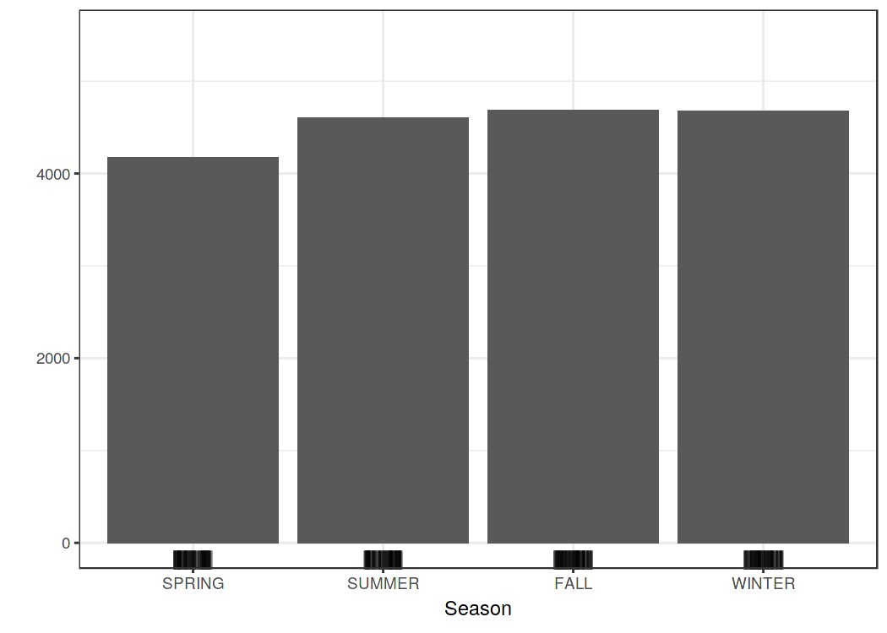

## Partial Dependence Plot (PDP) {#pdp}

The partial dependence plot (PDP or PD plot) shows the marginal effect of a feature on the predicted outcome of a previously fit model (J. H. Friedman 2001[^Friedman2001]). 
The prediction function is fixed at a few values of the chosen features and averaged over the other features.

<!-- *Keywords: partial dependence plots, PDP, PD plot, marginal means, predictive margins, marginal effects* -->

A partial dependence plot can show if the relationship between the target and a feature is linear, monotonic or more complex.
Applied to a linear regression model, partial dependence plots will always show a linear relationship, for example.

The partial dependence function for regression is defined as:

{$$}\hat{f}_{x_S}(x_S)=E_{x_C}\left[\hat{f}(x_S,x_C)\right]=\int\hat{f}(x_S,x_C)d\mathbb{P}(x_C){/$$}

The term {$$}x_S{/$$} is the set of features for which the partial dependence function should be plotted and {$$}x_C{/$$} are the other features that were used in the machine learning model {$$}\hat{f}{/$$}.
Usually, there are only one or two features in {$$}x_S{/$$}.
Concatenated, {$$}x_S{/$$} and {$$}x_C{/$$} make up {$$}x{/$$}.
Partial dependence works by marginalizing the machine learning model output {$$}\hat{f}{/$$} over the distribution of the features {$$}x_C{/$$}, so that the remaining function shows the relationship between the {$$}x_S{/$$}, in which we are interested, and the predicted outcome.
By marginalizing over the other features, we get a function that only depends on features {$$}x_S{/$$}, interactions between {$$}x_S{/$$} and other features included.

The partial function {$$}\hat{f}_{x_S}{/$$} along {$$}x_S{/$$} is estimated by calculating averages in the training data, which is also known as Monte Carlo method:

{$$}\hat{f}_{x_S}(x_S)=\frac{1}{n}\sum_{i=1}^n\hat{f}(x_S,x_{Ci}){/$$}

In this formula, {$$}x_{Ci}{/$$} are actual feature values from the dataset for the features in which we are not interested and {$$}n{/$$} is the number of instances in the dataset.
One assumption made for the PDP is that the features in {$$}x_C{/$$} are uncorrelated with the features in {$$}x_S{/$$}. 
If this assumption is violated, the averages, which are computed for the partial dependence plot, incorporate data points that are very unlikely or even impossible (see disadvantages).

For classification, where the machine model outputs probabilities, the partial dependence function displays the probability for a certain class given different values for features {$$}x_S{/$$}.
A straightforward way to handle multi-class problems is to plot one line or one plot per class.

The partial dependence plot is a global method:
The method takes into account all instances and makes a statement about the global relationship of a feature with the predicted outcome.

**Categorical features**

So far, we have only considered continuous features.
For categorical features, the partial dependence is very easy to calculate.
For each of the categories, we get a PDP estimate by forcing all data instances to have the same category.
For example, if we look at the bike rental dataset and are interested in the partial dependence plot for the season,  we get 4 numbers, one for each season.
To compute the value for "summer", we replace the season of all data instances with "summer" and average the predictions.

### Examples
In practice, the set of features {$$}x_S{/$$} usually only contains one feature or a maximum of two, because one feature produces 2D plots and two features produce 3D plots.
Everything beyond that is quite tricky.
Even 3D on a 2D paper or monitor is already challenging.

Let's return to the regression example, in which we predict the number of [bikes that will be rented on a day](#bike-data).
We first fit a machine learning model on the dataset, for which we want to analyse the partial dependencies.
In this case, we fitted a RandomForest to predict the bike count and use the partial dependence plot to visualize the relationships the model learned.
The influence of the weather features on the predicted bike counts:

For warm (but not too hot) weather, the model predicts a high number of bikes on average.
The potential bikers are increasingly inhibited in engaging in cycling when humidity reaches above 60%.
Also, the more wind the less people like to bike, which makes sense.
Interestingly, the predicted bike counts don't drop between 25 and 35 km/h windspeed, but there is just not so much training data, so we can't be confident about the effect.
At least intuitively I would expect the number of bikes to drop with any increase in windspeed, especially when the windspeed is very high.

To illustrate a partial dependence plot with a categorical feature, we examine the effect of the season feature on the predicted bike rentals.

We also compute the partial dependence for [cervical cancer classification](#cervical).
This time, we fit a random forest to predict whether a woman has cervical cancer given some risk factors. 
Given the model, we compute and visualize the partial dependence of the cancer probability on different features: 

![Partial dependence plots of cancer probability and the risk factors age and number of years with hormonal contraceptives. For the age feature, the partial dependence plot shows that on average the cancer probability is until 40 and increases after that. The sparseness of data points after age of 50 indicates that the model did not have many data points to learn from above that age. The number of years on hormonal contraceptives is associated with a higher cancer risk after 10 years. But again, there are not many data points in that region, which implies that we might not be able to rely on the machine learning model predictions for >10 years on contraceptives.](images/pdp-cervical-1.png)

We can also visualizes the partial dependence of two features at once:

![Partial dependence plot of cancer probability and the interaction of age and number of pregnancies. The plot shows the increase in cancer probability at 45, regardless of number of pregnancies. An interesting interaction happens at ages below 25: Young women who had 1 or 2 pregnancies have a lower predicted cancer risk, compared with women who had zero or above two pregnancies. The model predicts a - kind of - protective effect against cancer for 1 or 2 pregnancies. But be careful with drawing conclusions: This might just be a correlation and not causal! The cancer risk and number of pregnancies could be caused by another, unmeasured factor in which the young women differ.](images/pdp-cervical-2d-1.png)

### Advantages 
- The computation of partial dependence plots is **intuitive**: 
The partial dependence curve at a certain feature value represents the average prediction when we force all data points to take on that feature value. 
In my experience, laypersons usually grasp the idea of PDPs quickly.
- If the feature for which you computed the PDP is uncorrelated with the other model features, then the PDPs are perfectly representing how the feature influences the target on average.
In this uncorrelated case the **interpretation is clear**: 
The partial dependence plots shows how on average the prediction changes in your dataset, when the j-th feature is changed. 
It's complicated when features are correlated, see also disadvantages.
- Partial dependence plots are **simple to implement**.
- **Causal interpretation** : The calculation for the partial dependence plots has a causal interpretation: 
We intervene on {$$}x_j{/$$} and measure the changes in the predictions. 
By doing this, we analyse the causal relationship between the feature and the outcome.[^pdpCausal]
The relationship is causal for the model - because we explicitly model the outcome on the feature - but not necessarily for the real world!

### Disadvantages
- The **maximum number of features** you can look at jointly is realistically two or - if you are stubborn and pretend that 3D plots on a 2D medium are useful - three.
That's not the fault of PDPs, but of the 2-dimensional representation (paper or screen) and also our inability to imagine more than 3 dimensions.
- Some PD plots don't include the **feature distribution**. 
Omitting the distribution can be misleading, because you might over-interpret the line in regions, with almost no feature values.
This problem is easy to fix by showing a rug (indicators for data points on the x-axis) or a histogram.
- The **assumption of independence** poses the biggest issue of PD plots. 
The feature(s), for which the partial dependence is computed, is/are assumed to be independently distributed from the other model features we average over.
For example: Assume you want to predict how fast a person walks, given the person's weight and height. 
For the partial dependence of one of the features, let's say height, we assume that the other features (weight) are not correlated with height, which is obviously a wrong assumption. 
For the computation of the PDP at some height (for example at height = 200cm) we average over the marginal distribution of weight, which might include a weight below 50kg, which is unrealistic for a 2 meter person. 
In other words: When the features are correlated, we put weight on areas of the feature distribution where the actual probability mass is very low (for example it is unlikely that someone is 2 meters tall but weighting below 50kg).
A solution to this problem are [Accumulated Local Effect plots](#ale) or short ALE plots, which work with the conditional instead of the marginal distribution.
- **Heterogeneous effects might be hidden** because PD plots only show the average over the observations. 
Assume that for feature {$$}x_j{/$$} half your data points have a positive assocation with the outcome - the greater {$$}x_j{/$$} the greater {$$}\hat{y}{/$$} - and the other half has negative assocation - the smaller {$$}x_j{/$$} the greater {$$}\hat{y}{/$$}.
The curve might be a straight, horizontal line, because the effects of both dataset halves cancel each other out. 
You then conclude that the feature has no effect on the outcome. 
By plotting the [individiual conditional expectation curves](#ice) instead of the aggregated line, we can uncover heterogeneous effects.

### Software and Alternatives

There are a number of R packages that implement PDPs. 
I have used the `iml` package for the examples, but there is also `pdp` or `DALEX`.
In Python you can use `Skater`.

Alternatives to PDPs presented in this book are [ALE plots](#ale) and [ICE curves](#ice).

[^Friedman2001]: Friedman, Jerome H. 2001. "Greedy Function Approximation: A Gradient Boosting Machine." Annals of Statistics. JSTOR, 1189–1232.

[^pdpCausal]: Zhao, Q., & Hastie, T. (2016). Causal interpretations of black-box models. Technical Report.
