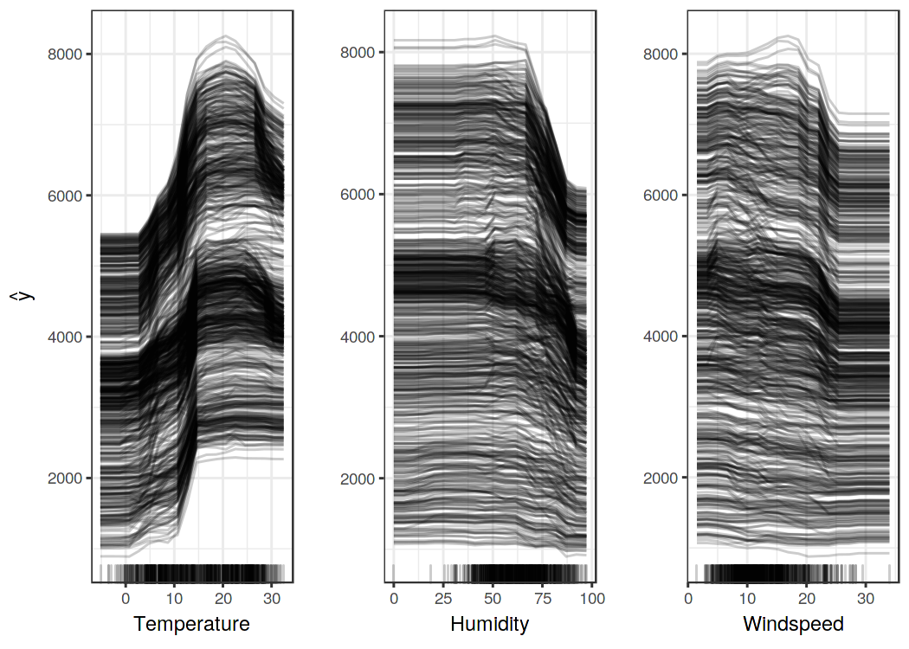

## Individual Conditional Expectation (ICE) {#ice}

For a chosen feature, Individual Conditional Expectation (ICE) plots draw one line per instance, representing how the instance's prediction changes when the feature changes. 

The partial dependence plot for visualizing the average effect of a feature is a global method, because it does not focus on specific instances, but on an overall average.
The equivalent to a PDP for local expectations is called individual conditional expectation (ICE) plot (Goldstein et al. 2015[^Goldstein2015]).
An ICE plot visualizes the dependence of the predicted response on a feature for EACH instance separately, resulting in multiple lines, one for each instance, compared to one line in partial dependence plots.
A PDP is the average of the lines of an ICE plot.
The values for a line (and one instance) can be computed by leaving all other features the same, creating variants of this instance by replacing the feature's value with values from a grid and letting the black box make the predictions with these newly created instances.
The result is a set of points for an instance with the feature value from the grid and the respective predictions.

So, what do you gain by looking at individual expectations, instead of partial dependencies?
Partial dependence plots can obfuscate a heterogeneous relationship that comes from interactions.
PDPs can show you how the average relationship between feature {$$}x_S{/$$} and {$$}\hat{y}{/$$} looks like.
This works only well in cases where the interactions between {$$}x_S{/$$} and the remaining {$$}x_C{/$$} are weak.
In case of interactions, the ICE plot will give a lot more insight.

A more formal definition:
In ICE plots, for each instance in {$$}\{(x_{S_i},x_{C_i})\}_{i=1}^N{/$$} the curve {$$}\hat{f}_S^{(i)}{/$$} is plotted against {$$}x_{S_i}{/$$}, while {$$}x_{C_i}{/$$} is kept fixed.

### Example
Let's go back to the dataset about [risk factors for cervical cancer](#cervical) and see how each instance's prediction is associated with the feature 'Age'.
The model we will analyze is a RandomForest that predicts the probability of cancer for a woman given risk factors.
In the [partial dependence plot](#pdp) we have seen that the cancer probability increases around the age of 50, but does it hold true for each woman in the dataset?
The ICE plot reveals that the most women's predicted probability follows the average pattern of increase at 50, but there are a few exceptions:
For the few women that have a high predicted probability at a young age, the predicted cancer probability does not change much with increasing age.

The next figures shows an ICE plot for the [bike rental prediction](#bike-data) (the underlying prediction model is a RandomForest).

All curves seem to follow the same course, so there seem to be no obvious interactions.
That means that the PDP is already a good summary of the relationships of the displayed features and the predicted bike rentals.

#### Centered ICE Plot
There is one issue with ICE plots:
It can be hard to see if the individual conditional expectation curves differ between individuals, because they start at different {$$}\hat{f}(x){/$$}.
An easy fix is to center the curves at a certain point in {$$}x_S{/$$} and only display the difference in the predicted response.
The resulting plot is called centered ICE plot (c-ICE).
Anchoring the curves at the lower end of {$$}x_S{/$$} is a good choice.
The new curves are defined as:
{$$}\hat{f}_{cent}^{(i)}=\hat{f}_i-\mathbf{1}\hat{f}(x^{\text{*}},x_{C_i}){/$$}
where {$$}\mathbf{1}{/$$} is a vector of 1's with the appropriate number of dimensions (usually one- or two-dimensional), {$$}\hat{f}{/$$} the fitted model and {$$}x^{\text{*}}{/$$} the anchor point.

#### Example
Taking for example the cervical cancer ICE plot for age and centering the lines at the youngest observed age yields:

With the centered ICE plots it is easier to compare the curves of individual instances.
This can be useful when we are not interested in seeing the absolute change of a predicted value, but rather the difference in prediction compared to a fixed point of the feature range.

The same for the bike dataset and count prediction model:

#### Derivative ICE Plot
Another way to make it visually easier to spot heterogeneity is to look at the individual derivatives of {$$}\hat{f}{/$$} with respect to {$$}x_S{/$$} instead of the predicted response {$$}\hat{f}{/$$}.
The resulting plot is called derivative ICE plot (d-ICE).
The derivatives of a function (or curve) tell you in which direction changes occur and if any occur at all.
With the derivative ICE plot it is easy to spot value ranges in a feature where the black box's predicted values change for (at least some) instances.
If there is no interaction between {$$}x_S{/$$} and {$$}x_C{/$$}, then {$$}\hat{f}{/$$} can be expressed as:

{$$}\hat{f}(x)=\hat{f}(x_S,x_C)=g(x_S)+h(x_C),\quad\text{with}\quad\frac{\delta\hat{f}(x)}{\delta{}x_S}{/$$}

Without interactions, the individual partial derivatives should be the same for all instances.
If they differ, it is because of interactions and it will become visible in the d-ICE plot.
In addition to displaying the individual curves for derivative {$$}\hat{f}{/$$}, showing the standard deviation of derivative {$$}\hat{f}{/$$} helps to highlight regions in {$$}x_S{/$$} with heterogeneity in the estimated derivatives.
The derivative ICE plot takes a long time to compute and is rather impractical.

### Advantages
- Individual conditional expectation curves are **even more intuitive to understand** than partial dependence plots: One line represents the predictions for one instance when we vary the feature of interest. 
- In contrast to partial dependence plots they can **uncover heterogeneous relationships**.

### Disadvantages 
- ICE curves **can only display one feature** meaningfully, because two features would require drawing multiple, overlaying surfaces and there is no way you would still see anything in the plot.
- ICE curves suffer from the same problem as PDPs: 
When the feature of interest is correlated with the other features, then **not all points in the lines might be valid data points** according to the joint feature distribution. 
- When many ICE curves are drawn the plot **can become overcrowded** and you don't see anything any more. 
The solution: either add some transparency to the lines or only draw a sample of the lines.
- In ICE plots it might not be easy to **see the average**. 
This has a simple solution: just combine individual conditional expectation curves with the partial dependence plot.
