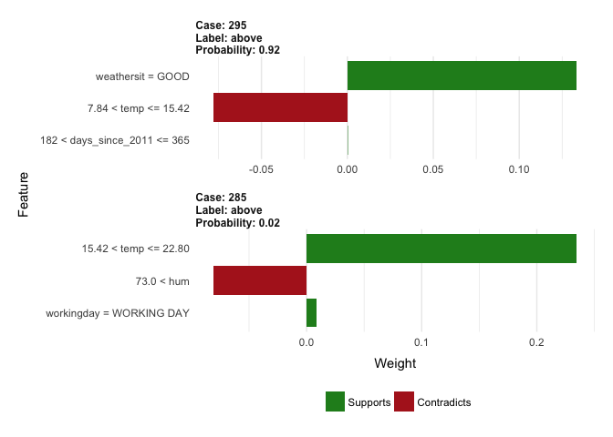
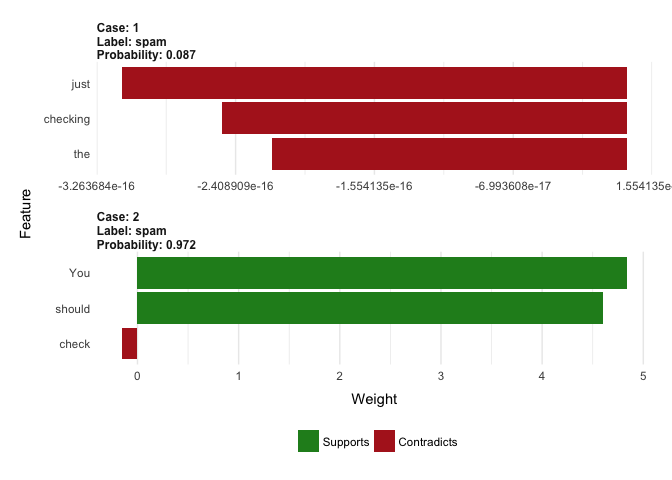

## Local Surrogate Models (LIME) {#lime}
Local interpretable model-agnostic explanations (LIME) is a method for fitting local, interpretable models that can explain single predictions  of any black-box machine learning model.
LIME explanations are local surrogate models.
Surrogate models are interpretable models (like a linear model or decision tree) that are learned on the predictions of the original black box model.
But instead of trying to fit a global surrogate model, LIME focuses on fitting local surrogate models to explain why single predictions were made.

The idea is quite intuitive.
First of all, forget about the training data and imagine you only have the black box model where you can input data points and get the models predicted outcome.
You can probe the box as often as you want.
Your goal is to understand why the machine learning model gave the outcome it produced.
LIME tests out what happens to the model's predictions when you put feed variations of your data into the machine learning model.
LIME generates a new dataset consisting of perturbed samples and the associated black box model's predictions.
On this dataset LIME then trains an interpretable model weighted by the proximity of the sampled instances to the instance of interest.
The interpretable model can basically be anything from [this chapter](#simple), for example [LASSO](#lasso) or a [decision tree](#tree).
The learned model should be a good approximation of the machine learning model locally, but it does not have to be so globally.
This kind of accuracy is also called local fidelity.

The recipe for fitting local surrogate models:

- Choose your instance of interest for which you want to have an explanation of its black box prediction.
- Perturb your dataset and  get the black box predictions for these new points.
- Weight the new samples by their proximity to the instance of interest.
- Fit a weighted, interpretable model on the dataset with the variations.
- Explain prediction by interpreting the local model.

In the current implementations ([R](https://github.com/thomasp85/lime) and [Python](https://github.com/marcotcr/lime)) for example linear regression can be chosen as interpretable surrogate model.
Upfront you have to choose {$$}K{/$$}, the number of features that you want to have in your interpretable model.
The lower the {$$}K{/$$}, the easier the model is to interpret, higher {$$}K{/$$} potentially creates models with higher fidelity.
There are different methods for how to fit models with exactly {$$}K{/$$} features. A solid choice is [Lasso](#lasso).
A Lasso model with a high regularisation parameter {$$}\lambda{/$$} yields a model with only the intercept.
By refitting the Lasso models with slowly decreasing {$$}\lambda{/$$}, one after each other, the features are getting weight estimates different from zero.
When {$$}K{/$$} features are in the model, you reached the desired number of features. Other strategies are forward or backward selection of features.
This means you either start with the full model (=containing all features) or with a model with only the intercept and then testing which feature would create the biggest improvement when added or removed, until a model with {$$}K{/$$} features is reached.
Other interpretable models like decision trees are also possible.

As always, the devil's in the details.
In a high-dimensional space, defining a neighbourhood is not trivial.
Distance measures are quite arbitrary and distances in different dimensions (aka features) might not be comparable at all.
How big should the neighbourhood be?
If it is too small, then there might be no difference in the predictions of the machine learning model at all.
LIME currently has a hard coded kernel and kernel width, which define the neighbourhood, and there is no answer how to figure out the best kernel or how to find the optimal width.
The other question is:
How do you get the variations of the data?
This differs depending on the type of data, which can be either text, an image or tabular data. For text and image the solution is turning off and on single words or super-pixels.
In the case of tabular data, LIME creates new samples by perturbing each feature individually, by drawing from a normal distribution with mean and standard deviation from the feature.

LIME does a good job in creating selective explanations, which humans prefer.
That's why I see LIME more in applications where the recipient of the explanation is a lay-person or someone with very little time.
It is not sufficient for complete causal attributions, so I don't see LIME in compliance scenarios, where you are legally required to fully explain a prediction.
Also for debugging machine learning models it is useful to have all the reasons instead of a few.

### LIME for Tabular Data
Tabular data means any data that comes in tables, where each row represents an instance and each column a feature.
LIME sampling is not done around the instance of interest, but from the training data's mass centre, which is problematic.
But it increases the likelihood that the outcome for some of the sampled points predictions differ from the data point of interest and that LIME can learn at least some explanation.

Figure \@ref(fig:lime-fitting) explains how the sampling and local model fitting works.

![How LIME sampling works: A) The black box model predicts one of two classes given feature x1 and x2. Most data points have class 0 (darker colour), and the ones with class 1 are grouped in an upside-down V-shape (lighter colour). The plot displays the decision boundaries learned by a machine learning model. In this case it was a Random Forest, but it does not matter, because LIME is model-agnostic and we only care about the decision boundaries. B) The yellow point is the instance of interest, which we want to explain. The black dots are data sampled from a normal distribution around the means of the features in the training sample. This needs to be done only once and can be reused for other explanations. C) Introducing locality by giving points near the instance of interest higher weights. D) The colours and signs of the grid display the classifications of the locally learned model form the weighted samples. The white line marks the decision boundary (P(class) = 0.5) at which the classification of the local model changes.](images/lime-fitting-1.png)

#### Example
Let's look at a concrete example.
We go back to the [bike rental data](#bike-data) and turn the prediction problem into a classification:
After accounting for the trend that the bike rental get's more popular over time we want to know on a given day if the number of rented bikes will be above or below the trend line.
You can also interpret 'above' as being above the mean bike counts, but adjusted for the trend.

First we train a Random Forest with 100 trees on the classification task. Given seasonal and weather information, on which day will the number of bike rentals be above the trend-free average?

The explanations are created with 3 features.
Figure  \@ref(fig:lime-tabular-example-explain-plot-1) shows the results of the sparse local linear model that was fitted for two instances with different predicted classes.
It becomes clear from the figure, that it is easier to interpret categorical features than numerical features.
Figure  \@ref(fig:lime-tabular-example-explain-plot-2) shows a variant where the numerical features are turned into categorical features by putting them into bins along the quantiles.

### LIME for Text
LIME for text works differs from LIME for tabular data.
Variations of the data are created differently:
Starting from the original text, new texts are created by randomly removing words from it.
The dataset is represented with binary features for each word.
A feature is 1 if the respective word is included and 0 if it was removed.

#### Example
In this example we classify spam vs. ham of [YouTube comments](#spam-data).

The black box model is a decision tree on the document word matrix.
Each comment is one document (= one row) and each column is the number of occurrences of a specific word.
Decision trees are easy to understand, but in this case the tree is very deep.
Also in the place of this tree there could have been a recurrent neural network or a support vector machine that was trained on the embeddings from word2vec.
From the remaining comments two were selected for showing the explanations.

Let's look at two comments of this dataset and the corresponding classes:

|   |CONTENT                                        | CLASS|
|:--|:----------------------------------------------|-----:|
|24 |just checking the views                        |     0|
|9  |You should check my channel for Funny VIDEOS!! |     1|

In the next step we create some variations of the datasets, which are used in a local model.
For example some variations of one of the comments:

|   | You| should| check| my| channel| for| Funny| VIDEOS!!| prob| weight|
|:--|---:|------:|-----:|--:|-------:|---:|-----:|--------:|----:|------:|
|2  |   1|      0|     0|  0|       1|   1|     0|        1| 1.00|   0.50|
|3  |   1|      1|     0|  1|       1|   1|     1|        1| 1.00|   0.88|
|4  |   0|      0|     0|  1|       1|   1|     0|        1| 1.00|   0.50|
|5  |   1|      1|     0|  1|       1|   1|     1|        1| 1.00|   0.88|
|6  |   1|      1|     1|  1|       1|   0|     0|        1| 0.97|   0.75|

Each column corresponds to one word in the sentence.
Each row is a variation, 1 indicates that the word is part of this variation and 0 indicates that the word has been removed.
The corresponding sentence for the first variation is "``You should my channel for Funny VIDEOS!! prob``".
Figure \@ref(fig:lime-text-explanations) shows for two sentences (one spam, one no spam) the estimated local weights found by the LIME algorithm.

