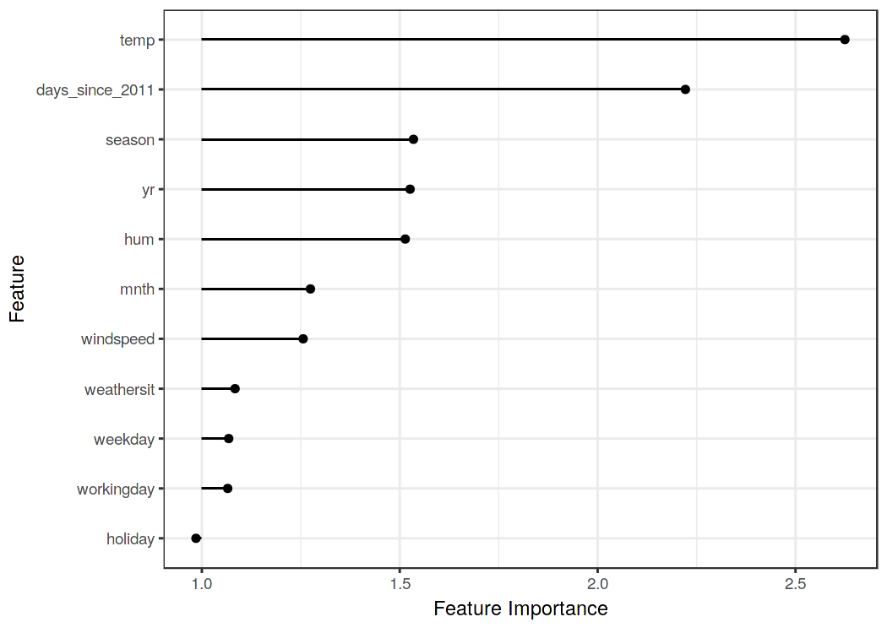

{pagebreak}

## Feature Importance {#feature-importance}
A feature's importance is the increase in the model's prediction error after we permuted the feature's values (breaks the relationship between the feature and the outcome). 

### The Theory
The concept is really straightforward: 
We measure a feature's importance by calculating the increase of the model's prediction error after permuting the feature.
A feature is "important", if permuting its values increases the model error, because the model relied on the feature for the prediction;
A feature is "unimportant" if permuting its values keeps the model error unchanged, because the model ignored the feature for the prediction.
The permutation feature importance measurement was introduced for Random Forests by Breiman (2001)[^Breiman2011].
Based on this idea, Fisher, Rudin, and Dominici (2018)[^Fisher2018] proposed a model-agnostic version of the feature importance - they called it model reliance. 
They also introduce more advanced ideas about feature importance, for example a (model-specific) version that accounts for the fact that many prediction models may fit the data well. 
Their paper is worth a read. 

**The algorithm:**

Input: Trained model {$$}\hat{f}{/$$}, feature matrix {$$}X{/$$}, target vector {$$}Y{/$$}, error measure {$$}L(Y,\hat{Y}){/$$}

1. Estimate the original model error {$$}e_{orig}(\hat{f})=L(Y,\hat{f}(X)){/$$}  (e.g. mean squared error)
2. For each feature {$$}j\in1,\ldots,p{/$$} do
    - Generate feature matrix {$$}X_{perm_{j}}{/$$} by permuting feature {$$}X_j{/$$} in {$$}X{/$$}. This breaks the association between {$$}X_j{/$$} and {$$}Y{/$$}.
    - Estimate error {$$}e_{perm}=L(Y,\hat{f}(X_{perm_j})){/$$} based on the predictions of the permuted data.
    - Calculate permutation feature importance {$$}FI_j=e_{perm}(\hat{f})/e_{orig}(\hat{f}){/$$}. Alternatively, the difference can be used: {$$}FI_j=e_{perm}(\hat{f})-e_{orig}(\hat{f}){/$$}
3. Sort variables by descending {$$}FI{/$$}.

In their paper, Fisher, Rudin, and Dominici (2018) propose to split the dataset in half and exchange the {$$}X_j{/$$} values of the two halves instead of permuting {$$}X_j{/$$}. 
This is exactly the same as permuting the feature {$$}X_j{/$$} if you think about it. 
If you want to have a more accurate estimate, you can estimate the error of permuting {$$}X_j{/$$} by pairing each instance with the {$$}X_j{/$$} value of each other instance (except with itself). 
This gives you a dataset of size {$$}n(n-1){/$$} to estimate the permutation error and it takes a big amount of computation time. 
I can only recommend using the {$$}n(n-1){/$$} - method when you are serious about getting extremely accurate estimates.

### Example and Interpretation

We show examples for classification and regression. 

**Cervical cancer (Classification)**

We fit a random forest model to predict [cervical cancer](#cervical).
We measure the error increase by: {$$}1-AUC{/$$} (one minus the area under the ROC curve).
Features that are associated model error increase by a factor of 1 (= no change) were not important for predicting cervical cancer.

The feature with the highest importance was  associated with an error increase of 7.01 after permutation.

**Bike rentals (Regression)**

We fit a support vector machine model to predict [bike rentals](#bike-data), given weather conditions and calendric information.
As error measurement we use the mean absolute error.

### Advantages
- Nice interpretation: Feature importance is the increase of model error when the feature's information is destroyed.
- Feature importance provides a highly compressed, global insight into the model's behavior. 
- A positive aspect of using the error ratio instead of the error difference is that the feature importance measurements are comparable across different problems. 

### Disadvantages
- The feature importance measure is tied to the error of the model.
This is not inherently bad, but in some cases not what you need.
In some cases you would prefer to know how much the model's output varies for one feature, ignoring what it means for the performance.
For example: You want to find out how robust your model's output is, given someone manipulates the features. 
In this case, you wouldn't be interested in how much the model performance drops given the permutation of a feature, but rather how much of the model's output variance is explained by each feature. 
Model variance (explained by the features) and feature importance correlate strongly, when the model generalizes well (i.e. it doesn't overfit).
- You need access to the actual outcome target. 
If someone only gives you the model and unlabeled data - but not the actual target-  you can't compute the permutation feature importance. 

[^Breiman2001]: Breiman, Leo. 2001. “Random Forests.” Machine Learning 45 (1). Springer: 5–32.

[^Fisher2018]: Fisher, Aaron, Cynthia Rudin, and Francesca Dominici. 2018. “Model Class Reliance: Variable Importance Measures for any Machine Learning Model Class, from the ‘Rashomon’ Perspective.” http://arxiv.org/abs/1801.01489.

