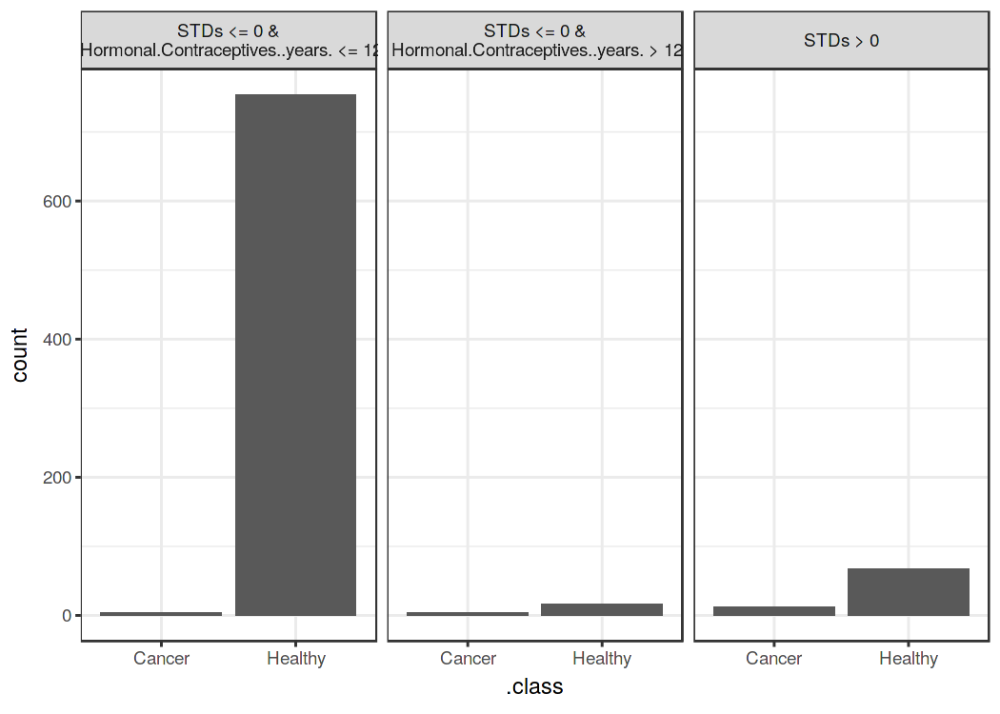

{pagebreak}

## Global Surrogate Models  {#global}

A global surrogate model is an interpretable model that is trained to approximate the predictions of a black box model. We can draw conclusions about the black box model by interpreting the surrogate model. Solving machine learning interpretability by using more machine learning!

### Theory

<!-- origins -->
Surrogate models are also used in engineering:
When an outcome of interest is expensive, time-consuming or otherwise difficult to measure (for example because it comes from a complex computational simulation), a cheap and fast surrogate model of the outcome is used instead. 
The difference between the surrogate models used in engineering and for interpretable machine learning is that the underlying model is a machine learning model (not a simulation) and that the surrogate model has to be interpretable. 
The purpose of (interpretable) surrogate models is to approximate the predictions of the underlying model as closely as possible while being interpretable.
You will find the idea of surrogate models under a variety of names:
Approximation model, metamodel, response surface model, emulator, ...

So, about the theory:  there is actually not much theory needed to understand surrogate models. 
We want to approximate our black box prediction function {$$}\hat{f}(x){/$$} as closely as possible with the surrogate model prediction function {$$}\hat{g}(x){/$$}, under the constraint that {$$}g{/$$} is interpretable.
Any interpretable model - for example from the [interpretable models chapter](#simple) - can be used for the function {$$}g{/$$}:

For example a linear model:

{$$}\hat{g}(x)=\beta_0+\beta_1{}x_1{}+\ldots+\beta_p{}x_p{/$$}

Or a decision tree:

{$$}\hat{g}(x)=\sum_{m=1}^Mc_m{}I\{x\in{}R_m\}{/$$}

Fitting a surrogate model is a model-agnostic method, since it requires no information about the inner workings of the black box model, only the relation of input and predicted output is used. 
If the underlying machine learning model would be exchanged for another, you could still apply the surrogate method.
The choice of the black box model type and of the surrogate model type is decoupled.

Perform the following steps to get a surrogate model:

1. Choose a dataset {$$}X{/$$}. 
This could be the same dataset that was used for training the black box model or a new dataset from the same distribution.
You could even choose a subset of the data or a grid of points, depending on your application. 
1. For the chosen dataset {$$}X{/$$}, get the predictions {$$}\hat{y}{/$$} of the black box model.
1. Choose an interpretable model (linear model, decision tree, ...).
1. Train the interpretable model on the dataset {$$}X{/$$} and its predictions {$$}\hat{y}{/$$}.
1. Congratulations! You now have a surrogate model.
1. Measure how well the surrogate model replicates the prediction of the black box model.
1. Interpret / visualize the surrogate model.

You might find approaches for surrogate models which have some extra steps or differ a bit, but the general idea is usually the same as described here.

<!-- measure fit -->
A way to measure how well the surrogate replicates the black box model is the R squared measure: 

{$$}R^2=1-\frac{SSE}{SST}=1-\frac{\sum_{i=1}^n(\hat{y}^*_i-\hat{y}_i)^2}{\sum_{i=1}^n(\hat{y}_i-\bar{\hat{y}})^2}{/$$}

where {$$}\hat{y}^*_i{/$$} is the prediction for the i-th instance of the surrogate model and respectively {$$}\hat{y}_i{/$$} of the black box model.
The mean of the black box model predictions is {$$}\bar{\hat{y}}{/$$}.
{$$}SSE{/$$} stands for sum of squares error and {$$}SST{/$$} for sum of squares total. 
The R squared measure can be interpreted as the percentage of variance that is captured by the interpretable model. 
If the R squared is close to 1 (= low {$$}SSE{/$$}), then the interpretable model approximates the behaviour of the black box model very well. 
If the interpretable model is that close, you might want to replace the complex model with the interpretable model.
If the R squared is close to 0 (= high {$$}SSE{/$$}), then the interpretable model fails to explain the black box model.

Note that we haven't talked about the model performance of the underlying black box model, meaning how well or badly it performs at predicting the real outcome. 
For fitting the surrogate model, the performance of the black box model does not matter at all. 
The interpretation of the surrogate model is still valid, because it makes statements about the model and not about the real world.
But of course, the interpretation of the surrogate model becomes irrelevant if the black box model sucks, because then the black box model itself is irrelevant.

<!-- More ideas-->
We could also build a surrogate model based on a subset of the original data or re-weight the instances.
In this way, we change the distribution of the surrogate model's input, which changes the focus of the interpretation (then it is not really global any longer).
When we weight the data locally around a certain instance of the data (the closer the instances to the chosen instance, the higher their weight) we get a local surrogate model, which can be used to explain the instance's individual prediction.
Learn more about local models in the [following chapter](#lime).

### Example
To demonstrate the surrogate models, we look at a regression and a classification example.

First, we fit a support vector machine to predict the daily number of [bike rentals](#bike-data) given weather and calendrical information.
The support vector machine is not very interpretable, so we fit a surrogate with a CART decision tree as interpretable model to approximate the behaviour of the support vector machine.

The surrogate model has an R squared (variance explained) of 0.77 which means it approximates the underlying black box behaviour quite well, but not perfectly.
If the fit would be perfect, we could actually throw away the support vector machine and use the tree instead.

In our second example, we predict the probability for [cervical cancer](#cervical) with a random forest.
Again we fit a decision tree, using the original dataset, but with the prediction of the random forest as outcome, instead of the real classes (healthy vs. cancer) from the data.

The surrogate model has an R squared (variance explained) of 0.2 which means it doesn't approximate the  random forest well and we should not over-interpret the tree, when drawing conclusions about the complex model.

### Advantages 
- The surrogate model method is **flexible**: Any model from the [interpretable models chapter](#simple) can be used.
This also means that you can swap not only the interpretable model, but also the underlying black box model.
Let's say you build some complex model and you want to explain it to different teams in your company.
One team is familiar with linear models; the other team prefers decision trees.
You can fit two surrogate models (linear model and decision tree) for the original black box model and offer two kinds of explanations.
If you find a better performing black box model, you don't have to change the way you do interpretation, because you can use the same class of surrogate models.
- I'd argue that the approach is very **intuitive** and straightforward.
This means it is easy to implement, but also easy to explain to people not familiar with data science or machine learning.
- With the R squard measure, we can easily **measure** how good our surrogate models are in terms of approximation of the black box predictions. 

### Disadvantages
- Be careful to draw **conclusions about the model, not the data**, since the surrogate model never sees the real outcome.
- It's not clear what the best **cut-off for R squared** is in order to be confident that the surrogate model is close enough to the black box model.
80% of variance explained? 50%? 99%?
- We can measure how close the surrogate model is to the black box model. 
Let's assume we are not very close, but close enough. 
It could happen that the interpretable model is very **close for a subset of the dataset, but wildly diverges for another subset**. 
In this case the interpretation for the simple model would not be equally good for all data points.
- The interpretable model you choose as a surrogate **comes with all its advantages and disadvantages**. 
- Some people argue that there are - in general - **no intrinsically interpretable models** (including even linear models and decision trees) and that it would even be dangerous to have an illusion of interpretability. 
If you share this opinion, then this method is, of course, not for you.
